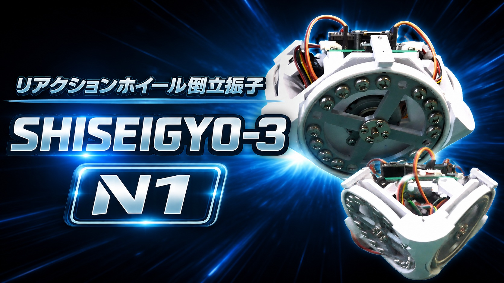

# SHISEIGYO-3 N1

  

リアクションホイール倒立振子モジュール  
ESP32ベースのリアルタイム制御・ブラウザ調整対応。

## Links

- 使用方法  
  https://homemadegarbage.com/reactionwheel84

- Shop  
  https://shop.homemadegarbage.com/product/s-3-n1/

## Development Environment

- Arduino IDE: ver. 1.8.19
- ESP32 board package: ver. 2.0.13

## Required Libraries

### MPU6050
 MPU6050 : https://github.com/jrowberg/i2cdevlib/tree/master/Arduino/MPU6050
 I2Cdev : https://github.com/jrowberg/i2cdevlib/tree/master/Arduino/I2Cdev

### Kalman Filter Library
Version: 1.0.2
https://github.com/TKJElectronics/KalmanFilter

### Adafruit GFX Library
Version: 1.10.1
https://github.com/adafruit/Adafruit-GFX-Library

### Adafruit SSD1306
Version: 2.4.1
https://github.com/adafruit/Adafruit_SSD1306

## Features

- リアクションホイール倒立制御
- ブラウザベース調整UI
- Wi-Fi APモード
- パラメータ保存機能
- GetUp機能
- ブレーキ調整UI

## License

MIT License
